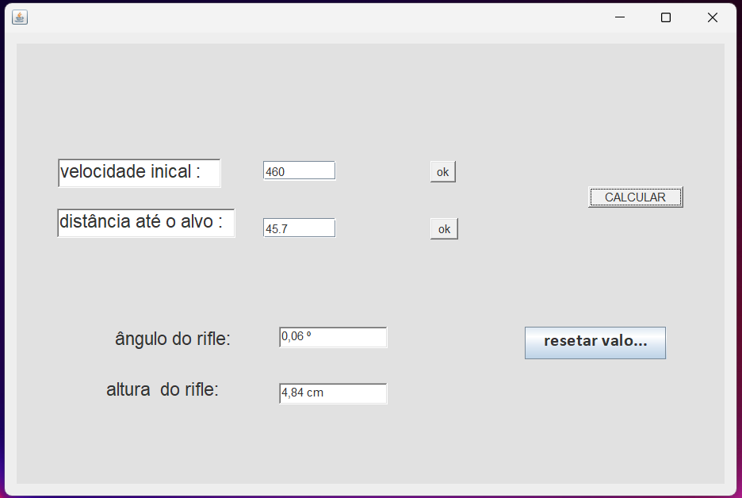

# 🧮 Calculadora Java para exercício de Física

Uma calculadora simples feita em Java com interface gráfica (`JFrame`).

Foi pensada para que atraves de valores da velocidade e da distancia de um rifle com o alvo, fosse calculada a altura e o angulo necessario para que o tiro acerto o meio do alvo. O progama calcula com base em dados fornecidos pelo usuario e mostra os resultados na tela 

---

## 📸 Preview da interface

---

## 🚀 Funcionalidades

- ✅ Interface gráfica (Swing)
- ✅ Validação de entrada
- ✅ Calculo de lançamento
- ✅ Erros tratados com mensagens

---
